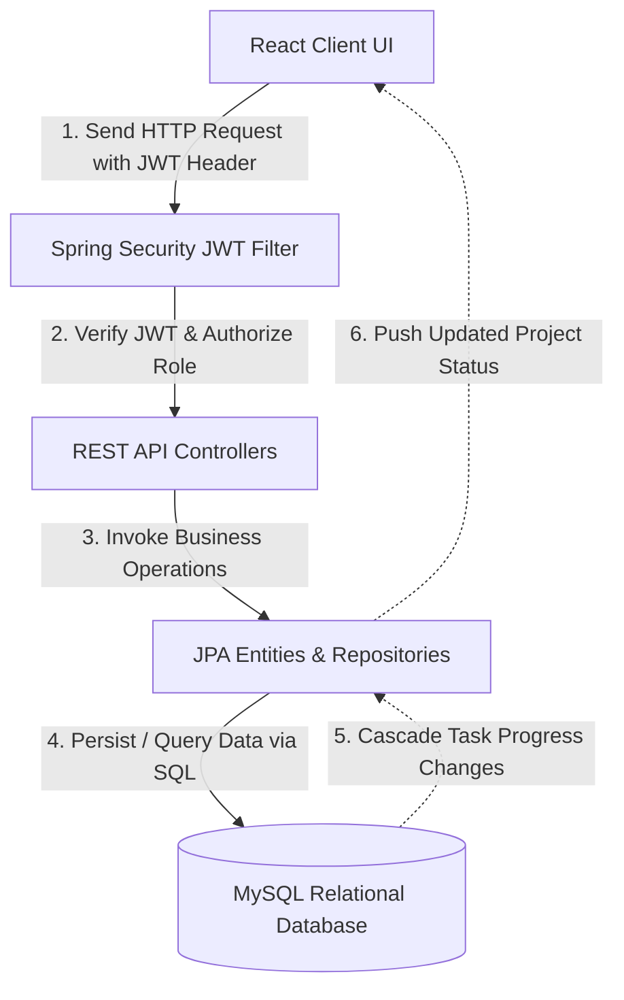
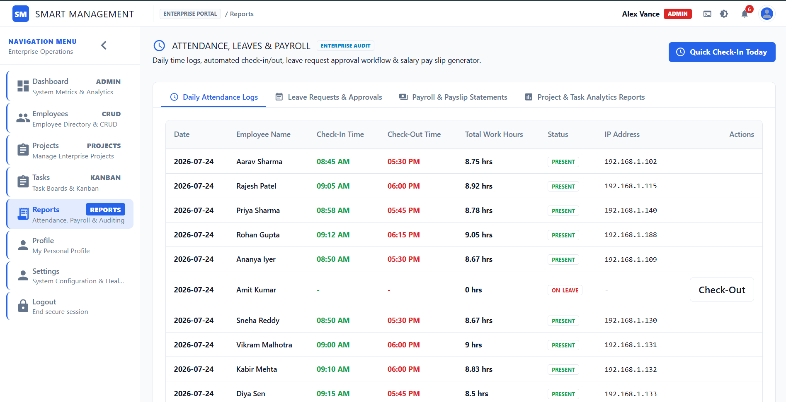

# Smart Employee & Project Management System (Enterprise ERP)

[](https://spring.io/projects/spring-boot)
[](https://reactjs.org/)
[](https://www.typescriptlang.org/)
[](https://mui.com/)
[](https://www.mysql.com/)
[](https://www.docker.com/)

A full-stack, enterprise-grade Employee & Project Management System (ERP & HCM) developed with ReactJS (TypeScript, Vite) on the frontend and Spring Boot on the backend. 

The application utilizes Spring Security with JWT tokens for role-based authentication. It provides distinct, secure dashboards for Administrators (for HR CRUD operations, resource allocations, and audit logs) and Employees (for workload tracker, milestones, and reports).

---

## System Flowchart & Architecture

The following flowchart details the lifecycle of User Authentication, Employee records, Projects, Tasks, and Database persistence:



---

## Features

### Authentication
- Secure Registration: Full self-registration portal for users to create administrative or employee accounts.
- Login & Logout: Secure JWT-based login session management.
- Role-Based Firewalls: Fine-grained access control ensuring users only view allowed dashboard tabs.

### Admin Features
- Employee CRUD: Create, read, update, and terminate employee records.
- Project Board: Setup projects, allocate resources, and track progress metrics.
- Task Management: Visual task creation and assignment boards.
- Dynamic Allocations: Assign multiple employees to projects and tasks.
- Advanced Grid Controls: Full search query filters, status filter dropdowns, and column sorting.

### Employee Features
- My Workspace: Clean, dedicated list of active tasks assigned to the employee.
- Task Updates: Update task progress status dynamically (TO_DO -> IN_PROGRESS -> IN_REVIEW -> COMPLETED).
- Milestone Deadlines: Track upcoming schedules and milestones sorted by priority.
- Time Clock Simulation: Check-in and check-out simulation logs to track daily hours.
- Payslips & Leaves: Access processed payroll summaries and request CASUAL/SICK leaves.

### Reports
- Employee-wise Task Reports: Detail cards summarizing workloads.
- Project Progress Reports: Track completions with automatically recalculated project progress based on child task completion ratios.
- Export Formats: Full support for exporting reports to CSV (Excel) and generating PDF Payslips dynamically using jsPDF and jspdf-autotable.

### Bonus & Advanced Features
- Dark Mode: Adaptive light/dark theme toggles utilizing custom Azure HSL palettes with local storage state preservation.
- Profile Image Upload: Upload profile avatars (accepts JPG/PNG/WEBP, up to 5MB) via multipart-form uploads.
- Security Audit Logs: Automatic auditing of user sessions, CRUD operations, client IPs, and query details in a structured log table.
- Swagger Documentation: Preconfigured endpoints for REST documentation and API testing.
- Docker Support: Containerized execution with custom multi-stage Dockerfiles.
- Unit Testing: Suite of backend Mockito unit tests ensuring core validation and security constraints.

---

## Technology Stack

### Frontend
- ReactJS (18.x) with TypeScript & Vite
- React Router Dom for navigation routing
- Material UI (MUI 5.x) for premium layouts and styling
- Axios for REST API requests with request/response interceptors
- jsPDF & jspdf-autotable for dynamic PDF reporting

### Backend
- Java 17 & Spring Boot 3.x
- Spring Security & JWT (JSON Web Tokens)
- Spring Data JPA & Hibernate for ORM
- Maven for dependencies and packaging

### Database
- MySQL 8.0 relational engine

### Tools
- Git & GitHub
- Postman for API validation
- Swagger Open API 3.0

---

## Project Architecture

The application is structured into a clean 4-Tier Layered Architecture:

```
Presentation Layer (React JS / Material UI Views)
       │ (Axios REST Requests / JWT Authorization Header)
       ▼
   Controller Layer (Spring REST Controllers — Auth, Employee, Project, Task)
       │ (Data Transfer Objects — DTO validation & mapping)
       ▼
   Service Layer (Business Logic & Transactional Interfaces)
       │ (Hibernate Entity Mapping & Spring Data JPA Repository Queries)
       ▼
Relational Persistence Layer (MySQL Database / JPA Entities)
```

- DTO Pattern: Requests and responses utilize validation annotations (@NotNull, @Size, @Email) to reject malformed input before processing.
- Global Error Handling: Spring @ControllerAdvice returns standardized JSON API responses.
- Security Interceptor: Extracts, verifies, and establishes JWT authentication inside Spring's SecurityContextHolder.

---

## Database Design

The relational database model features key entity relationships managed automatically via Hibernate cascading and JPA mappings:

- Employee <-> Projects (Many-to-Many): Managed via join-table tracking resource project allocations.
- Project -> Tasks (One-to-Many): A project contains multiple tasks. Progress rates cascade upwards to recalculate project status.
- Employee -> Tasks (One-to-Many): Tasks are assigned to specific employee entities for responsibility tracking.

---

## API Endpoints

Below are the major API endpoints configured in the Spring Boot backend:

| Category | Method | Endpoint | Description | Auth Required |
| :--- | :--- | :--- | :--- | :--- |
| **Authentication** | `POST` | `/api/auth/login` | Login user, returns JWT token | None |
| | `POST` | `/api/auth/register` | Register new user account | None |
| **Employees** | `GET` | `/api/employees` | Get all employees (with filters) | `ADMIN` |
| | `POST` | `/api/employees` | Create a new employee profile | `ADMIN` |
| | `PUT` | `/api/employees/{id}` | Update employee details | `ADMIN` |
| | `DELETE` | `/api/employees/{id}` | Terminate/delete employee record | `ADMIN` |
| | `GET` | `/api/employees/me` | Fetch logged-in employee profile | `EMPLOYEE` |
| **Projects** | `GET` | `/api/projects` | Get all active projects | `ADMIN` |
| | `POST` | `/api/projects` | Initialize a new project | `ADMIN` |
| **Tasks** | `GET` | `/api/tasks/assigned` | Get all task logs | `ADMIN` |
| | `PUT` | `/api/tasks/{id}` | Update task details & progress | `ADMIN` / `EMPLOYEE` |
| | `GET` | `/api/tasks/my` | Retrieve my assigned tasks | `EMPLOYEE` |

---

## Screenshots

### Login
*(Add Screenshot)*

*Modern dual-mode sign-in view with self-registration panels.*

### Admin Dashboard
*(Add Screenshot)*

*High-fidelity portal showcasing active counts, team load, and project metrics.*

### Employee Dashboard
*(Add Screenshot)*

*Personal home view showing checklist cards, quick actions, and attendance log.*

### Employee Management
*(Add Screenshot)*

*Directory list with inline editing, search queries, and employee profile creation.*

### Project Management
*(Add Screenshot)*

*Overview of project codes, budgets, and progress calculations.*

### Task Management
*(Add Screenshot)*

*Interactive task board sorting cards across active workflow columns.*

### Reports
*(Add Screenshot)*

*Details of audit logs, attendance logs, and payroll items with Excel/PDF export buttons.*

---

## Installation & Setup

### Clone
```bash
git clone https://github.com/Anish-Reddy-S/Evernoth.git
```

### Database Setup
Ensure you have a MySQL 8.0 server running. Execute the SQL setup script to seed tables and default roles:
```bash
mysql -u root -p < db_setup.sql
```
*This creates the database smart_management_db and seeds the admin user.*

### Backend
Ensure you have Java JDK 17 and Maven installed.
```bash
cd backend
# Clean build and compile
mvn clean install
# Run the Spring Boot application
mvn spring-boot:run
```
*The backend API will run on http://localhost:8080.*

### Frontend
Ensure you have Node.js 18+ installed.
```bash
cd frontend
# Install dependencies
npm install
# Start local Vite development server
npm run dev
```
*Open your browser and navigate to http://localhost:3000.*

---

## Environment Variables

The backend application configuration (backend/src/main/resources/application.properties) requires the following settings:

```properties
# Database Configuration
spring.datasource.url=jdbc:mysql://localhost:3306/smart_management_db?useSSL=false&serverTimezone=UTC
spring.datasource.username=root
spring.datasource.password=YourRootPassword

# JWT Configurations
app.jwt.secret=YourSuperSecretHMACSHA256SignatureVerificationKeyWithAtLeast256Bits
app.jwt.expirationMs=86400000

# Mail Configuration (Optional - for Email Notifications)
spring.mail.host=smtp.gmail.com
spring.mail.port=587
spring.mail.username=your-email@gmail.com
spring.mail.password=your-app-password
spring.mail.properties.mail.smtp.auth=true
spring.mail.properties.mail.smtp.starttls.enable=true
```

---

## Default Login Accounts

To sign in and test the system, you can use the default seeded account or register a new one:

### Administrator Profile (Seeded)
- Role Selection: ADMIN
- Username: admin
- Password: AdminPassword123!
- Email: admin@enterprise.com

### Employee Profile (Registration)
- Click "Create one" on the login screen to register.
- Select the role EMPLOYEE.
- Input the Employee ID (e.g. EMP-1011).

---

## Postman Collection
A complete Postman collection is included in the workspace at `backend/docs/postman/SmartManager_API.postman_collection.json`. 

Import this collection into Postman to run tests for:
- User Authentication (Login, Register JWT validation)
- Employee Records CRUD Operations
- Audit Trail Security Logs
- Project and Task Management Endpoints

---

## Database Script
The unified MySQL script `db_setup.sql` is provided in the repository root. This script handles database schema creation (smart_management_db), role allocations, table constraints, and initial mock data seed values.

---

## Folder Structure

```
Evernorth/
├── backend/                  # Spring Boot 3 Java Maven backend
│   ├── src/                  # Source code (Controllers, Services, Security, JPA)
│   ├── pom.xml               # Maven dependency configuration
│   └── Dockerfile            # Multi-stage Java build script
├── frontend/                 # React JS Vite client
│   ├── src/                  # React components, context handlers, and views
│   ├── package.json          # Node dependencies & run scripts
│   └── tsconfig.json         # TypeScript compiler rules
├── db_setup.sql              # Combined DDL Schema & DML data seed script
├── docker-compose.yml        # Orchestration composition script
└── README.md                 # Project README documentation
```

---

## Future Improvements
- Real-Time Notifications: Integrating WebSockets to notify users when a task is updated or a leave is approved.
- Hierarchical Roles: Introducing managers, regional supervisors, and HR managers.
- Visual Analytics: Interactive charts showing employee performance and budget statistics.
- Calendar Integrations: Syncing deadlines and leaves with Microsoft Outlook or Google Calendar.
- File Attachments: Enabling task cards to store files and documents in Amazon S3 buckets.

---

## Author

Created by Anish Reddy S - [GitHub Profile](https://github.com/Anish-Reddy-S)

*Developed for the Smart Employee & Project Management System Assessment.*
