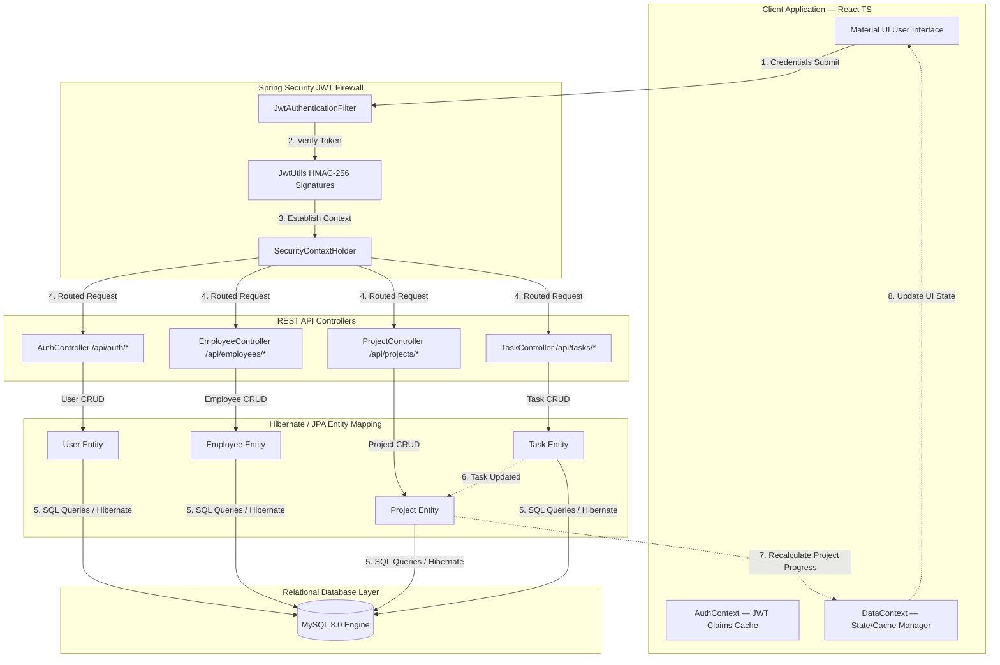

# Smart Employee & Project Management System (Enterprise ERP)
An end-to-end production-grade Enterprise Resource Planning (ERP) & Human Capital Management (HCM) platform structured into dedicated frontend and backend services.

## 🏛 System Flowchart (Mermaid)

The following flowchart details the system architecture and the lifecycle of Authentication, Employee management, Project allocations, Tasks, REST API Controller operations, and Database persistence.



---

## 🖼 Application Screenshots

Below are screenshots of the responsive enterprise interface:

### 1. Enterprise Operations Dashboard

*A sleek, state-of-the-art SaaS workspace highlighting system metrics, employee directories, and active projects.*

### 2. Task Kanban Board

*Interactive Kanban board tracking cards across TO DO, IN PROGRESS, IN REVIEW, and COMPLETED stages.*

---

## 📂 Repository Directory Layout

- `/backend`: The Spring Boot 3 Maven application.
- `/frontend`: The React, TypeScript, and Vite single page application.
- `/db_setup.sql`: Combined MySQL DDL schema and data seed script.

---

## 🚀 Getting Started

### 1. Database Setup
Ensure you have **MySQL 8.0** running. Run the unified setup script in your MySQL instance:
```bash
mysql -u root -p < db_setup.sql
```
*This creates the database `smart_management_db`, configures the security tables, and seeds initial employee profiles.*

### 2. Run the Backend (Spring Boot 3)
Ensure you have **Java JDK 17** and Maven installed.
```bash
cd backend

# Build and package the application
./mvnw clean package

# Run the backend server on Port 8080
java -jar target/smartmanager-backend-1.0.0-SNAPSHOT.jar
```
*Interactive API documentation and REST endpoints are available at: [http://localhost:8080/swagger-ui.html](http://localhost:8080/swagger-ui.html) when the backend is active.*

### 3. Run the Frontend (React + Vite)
Ensure you have **Node.js 18+** installed.
```bash
cd frontend

# Install packages
npm install

# Start Vite Dev Server (proxies requests automatically to 8080)
npm run dev
```
*Open your browser and navigate to [http://localhost:3000](http://localhost:3000).*

### 4. Containerized Orchestration (Docker Compose)
To launch the complete database and server stack containerized:
```bash
cd backend
docker-compose up -d --build
```

---

## 📊 Postman API Testing Collection
A complete Postman collection is included in the workspace at:
`[SmartManager_API.postman_collection.json](file:///c:/Users/sanna/Downloads/Evernorth/backend/docs/postman/SmartManager_API.postman_collection.json)`.

Import this collection into Postman to test:
- User Authentication (Login, Register JWT validation)
- Employee Records CRUD Operations
- Audit Trail Security Logs
- Project and Task Management Endpoints
