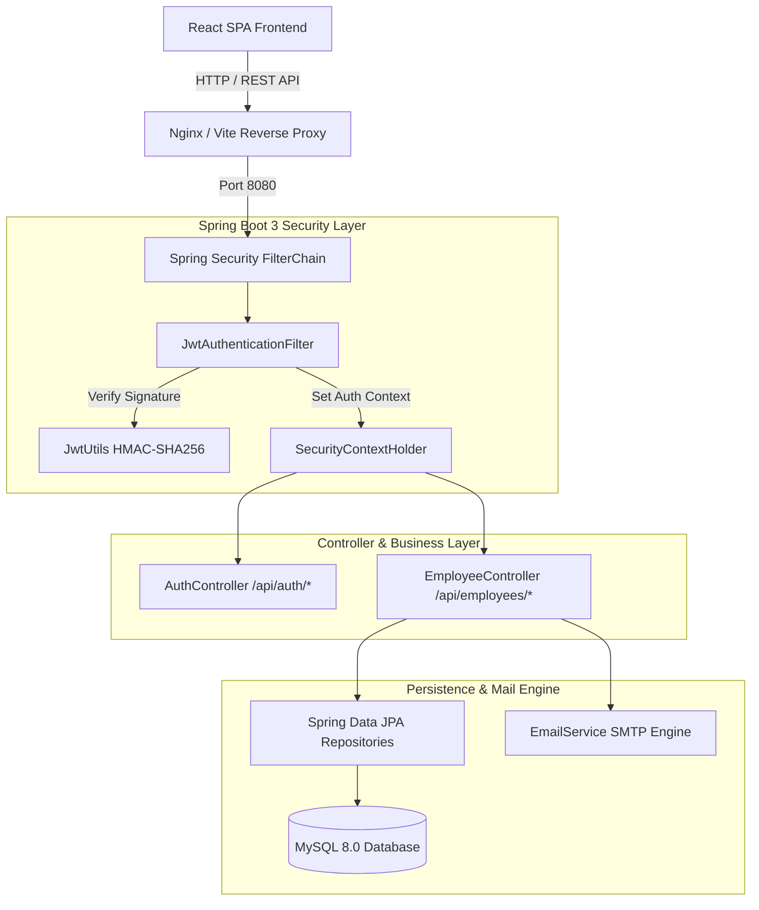

# Smart Employee & Project Management System — Full-Stack Spring Boot 3 & React Enterprise ERP

An end-to-end production-grade Enterprise Resource Planning (ERP) & Human Capital Management (HCM) platform structured into dedicated frontend and backend services.

- **Backend**: Spring Boot 3 REST API built with Java 17, Spring Security (JWT), Spring Data JPA, MySQL, Maven, Actuator endpoints, and Swagger OpenAPI.
- **Frontend**: React + Material-UI, styled in a premium, modern enterprise theme (inspired by Jira, Azure Portal, and Linear) with dark/light mode toggles.

---

## 🏛 Architecture Overview



---

## 📂 Repository Directory Layout

- `/backend`: The Spring Boot 3 Maven application.
- `/frontend`: The React, TypeScript, and Vite single page application.

---

## 🚀 Getting Started

### 1. Run the Backend (Spring Boot)

Ensure you have **Java JDK 17** installed.

```bash
cd backend

# Build and package the application
./mvnw clean package

# Run the backend server on Port 8080
java -jar target/smartmanager-backend-1.0.0-SNAPSHOT.jar
```

*The API documentation is available interactively at [http://localhost:8080/swagger-ui.html](http://localhost:8080/swagger-ui.html) when the backend is active.*

### 2. Run the Frontend (React + Vite)

Ensure you have **Node.js 18+** installed.

```bash
cd frontend

# Install packages
npm install

# Start the Vite server (proxies API requests automatically to Port 8080)
npm run dev
```

*Open your browser and navigate to [http://localhost:3000](http://localhost:3000).*

### 3. Docker Compose Orchestration

To run the complete stack (MySQL and the Java server) containerized:

```bash
cd backend
docker-compose up -d --build
```

---

## 📊 Postman API Testing Collection

A complete Postman collection is included in `backend/docs/postman/SmartManager_API.postman_collection.json` containing pre-configured requests for testing authentication, user registration, employee CRUD, and audit logs.
