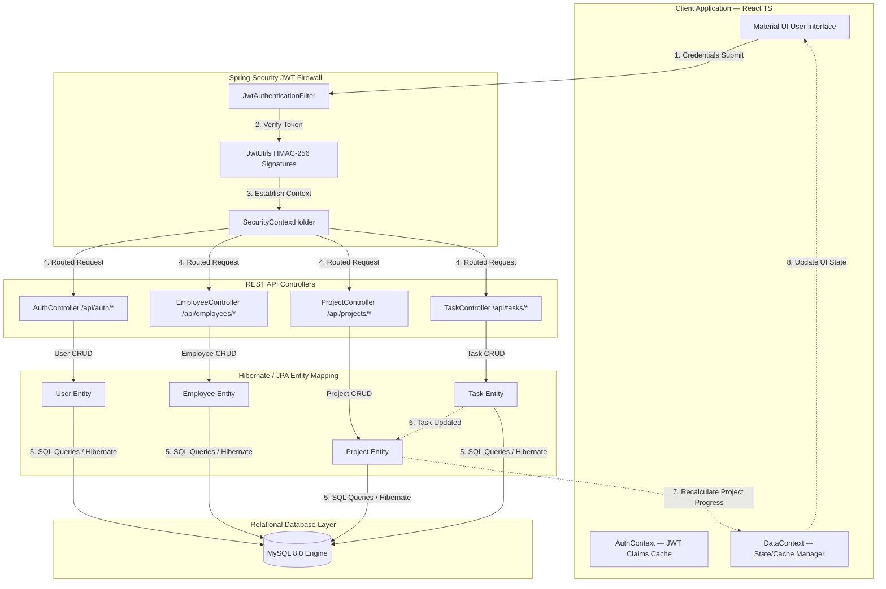

# Smart Employee & Project Management System (Enterprise ERP)
An end-to-end production-grade Enterprise Resource Planning (ERP) & Human Capital Management (HCM) platform structured into dedicated frontend and backend services.

## 🏛 System Flowchart (Mermaid)

The following flowchart details the system architecture and the lifecycle of Authentication, Employee management, Project allocations, Tasks, REST API Controller operations, and Database persistence.



---

## 🔑 Authentication & Login Credentials

To access the Smart Manager ERP portal, you can sign in using the seeded administrator account or register a new account via the portal's self-registration form.

### Default Administrator Credentials
* **Role Selection**: `ADMIN`
* **Username**: `admin`
* **Password**: `AdminPassword123!`
* **Seeded Email**: `admin@enterprise.com`

### Self-Registration
* Click **"Don't have an account? Create one"** on the login screen.
* Register as either `EMPLOYEE` or `ADMIN`.
* **Password Policy**: Must be at least 8 characters long, containing at least one uppercase letter, one lowercase letter, one number, and one special character (e.g., `@$!%*?&`).
* Employees can map their profile with their designated Employee ID (e.g., `EMP-1011`).

---

## ✨ Key Features & Capabilities

### 1. Role-Based Dashboards
* **Admin Dashboard**: Real-time telemetry, including active counts (Employees, Projects, Tasks completed), team work load, pending approvals, and system-wide action triggers (Create Project, Add Employee, View Audit Logs).
* **Employee Portal**: Workload summary, assigned tasks list, upcoming deadlines, leave request triggers, and payroll access.

### 2. Employee Management (CRUD) & Profile Uploads
* Full lifecycle administration (create, read, update, delete) of employee records.
* Search and filter by Employee Code, Name, Department, Designation, and employment status (`ACTIVE`, `ON_LEAVE`, `TERMINATED`).
* **Profile Image Upload**: Integrated avatar upload supporting JPG, PNG, and WEBP formats (up to 5MB multipart uploads) with visual preview and backend-linked updates.

### 3. Project Allocations & Auto-Progress
* Creation and mapping of enterprise projects.
* **Auto-Recalculation**: Project completion percentage is automatically computed based on the progress/completion of its constituent tasks.

### 4. Interactive Task Kanban Board
* Visual Kanban board with status columns: `TO DO`, `IN PROGRESS`, `IN REVIEW`, and `COMPLETED`.
* Status tracking cards with individual assignments, description, and urgency parameters.

### 5. Reporting & Compliance
* **Attendance Tracking**: Self-service check-in/check-out simulation and manager reports.
* **Payroll & Payslip Management**: Secure access to payslips and earnings summaries.

### 6. Security Audit Logging
* **SOC Audit Compliance**: Automatically logs all key operations (user login, creation, modification, deletion) with details of the performing username, affected entity, client IP address, and exact timestamps.

### 7. Email Notification Dispatch
* Automated notification system that fires emails to employees or admins on key lifecycle events (e.g., registration confirmation, status changes, task assignments, and payroll generation).

### 8. Premium Dark & Light Themes
* Supports instant **Dark Mode** and Light Mode toggling.
* Styled with custom Azure colors for modern, professional aesthetics and state-preservation on page refreshes.

### 9. Modern Developer Tools & DevOps
* **Swagger REST API Inspector**: Integrated Swagger UI inspector inside the React application to browse, verify, and execute REST endpoints on the fly.
* **Docker Containerization**: Pre-configured Docker orchestration via multi-stage `Dockerfile` and `docker-compose.yml` to launch MySQL, Java Spring Boot backend, and React Vite frontend in single-command orchestrations.
* **Unit Testing Suite**: Robust code coverage through JUnit 5 and Mockito tests (e.g., `AuthControllerTest.java` and `EmployeeServiceTest.java`) ensuring API stability and correct logic flow.

---

## 🖼 Application Screenshots

Below are screenshots of the responsive enterprise interface:

### 1. Enterprise Operations Dashboard

*A sleek, state-of-the-art SaaS workspace highlighting system metrics, employee directories, and active projects.*

### 2. Task Kanban Board

*Interactive Kanban board tracking cards across TO DO, IN PROGRESS, IN REVIEW, and COMPLETED stages.*

---

## 📂 Repository Directory Layout

- `/backend`: The Spring Boot 3 Maven application.
- `/frontend`: The React, TypeScript, and Vite single page application.
- `/db_setup.sql`: Combined MySQL DDL schema and data seed script.

---

## 🚀 Getting Started

### 1. Database Setup
Ensure you have **MySQL 8.0** running. Run the unified setup script in your MySQL instance:
```bash
mysql -u root -p < db_setup.sql
```
*This creates the database `smart_management_db`, configures the security tables, and seeds initial employee profiles.*

### 2. Run the Backend (Spring Boot 3)
Ensure you have **Java JDK 17** and Maven installed.
```bash
cd backend

# Build and package the application
./mvnw clean package

# Run the backend server on Port 8080
java -jar target/smartmanager-backend-1.0.0-SNAPSHOT.jar
```
*Interactive API documentation and REST endpoints are available at: [http://localhost:8080/swagger-ui.html](http://localhost:8080/swagger-ui.html) when the backend is active.*

### 3. Run the Frontend (React + Vite)
Ensure you have **Node.js 18+** installed.
```bash
cd frontend

# Install packages
npm install

# Start Vite Dev Server (proxies requests automatically to 8080)
npm run dev
```
*Open your browser and navigate to [http://localhost:3000](http://localhost:3000).*

### 4. Containerized Orchestration (Docker Compose)
To launch the complete database and server stack containerized:
```bash
cd backend
docker-compose up -d --build
```

---

## 📊 Postman API Testing Collection
A complete Postman collection is included in the workspace at:
`[SmartManager_API.postman_collection.json](file:///c:/Users/sanna/Downloads/Evernorth/backend/docs/postman/SmartManager_API.postman_collection.json)`.

Import this collection into Postman to test:
- User Authentication (Login, Register JWT validation)
- Employee Records CRUD Operations
- Audit Trail Security Logs
- Project and Task Management Endpoints
